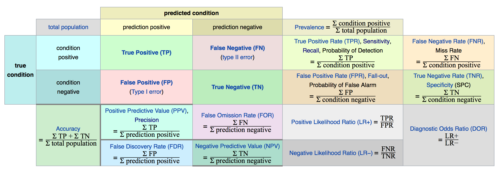
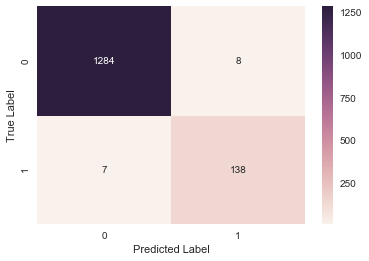

Binary classifier performance을 측정하기 위해서 사용되는 Confusion matrix, Precision, Recall, 그리고 F1-Score에 대해서 설명한다.

### Confusion Matrix

Classifier의 경우 [confusion matrix](https://en.wikipedia.org/wiki/Confusion_matrix)을 이용하여 performance을 계산한다. 

좌측은 실제 label의 분류(True condition)이고, 상위가 예측한 분류(predicted condition)이 된다.  


> Confusion matrix에 대한 개인적인 해석은 이렇게 한다. Predicted label이 Positive인데, 실제 label도 Positive인 경우는 True Positive, 아닐 경우는 False Positive. 즉, 예측한 label이 뒷쪽에 오고 실제 label과 비교하여 True/False을 결정하여 앞에 두면 된다.Predicted label이 Negative인데 실제 label도 negative이면 True Negative, 아니면 False Negative가 된다. 

Confusion matrix을 이용하여  positive로 예측한 전체 개수 대비 real label과 비교하여 True인가를 계산한 것이 **Precision**이다. 
$$
\text{precision} = \frac{\text{True Positive}}{\text{True Positive} + \text{False Positive}}
$$
그러나, sample data 하나에 대해서 positive로 예측하고, 그 실제 label 도 True인 경우 precision은 1이 된다. 따라서, precision만 따로 사용하지 않고 **Recall**을 함께 사용한다.
$$
\text{Recall} = \frac{\text{True Positive}}{\text{True Positive} + \text{False Negative}}
$$
예를 들어 precision이 77%인 경우 전체 예상한 값 중에 77%가 정확하게 예측한 것이고, recall이 79%인 경우 실제 positive한 경우의 79%만 detection한 것으로 해석 할 수 있다.


이 두 metric을 하나의 metric으로 표현하기도 하는데 이는  **$F_1$ score** 라고 한다. 이는 precision과 recall의 *harmonic mean*으로 표현된다.
$$
\begin{align}
F_1 &= \frac{2}{\frac{1}{\text{precision}} + \frac{1}{recall}} \\[1.5em]
&=2 \times \frac{\text{precision} \times \text{recall}}{\text{precision}+\text{recall}} \\[1.5em]
&=\frac{TP}{TP + \frac{FN+FP}{2}}
\end{align}
$$

>Whereas the regular mean treats all values equally, the harmonic mean give much more weight to low values. As a result, the classifier will only get a high $F_1$ score if both recall and precision are high.


#### Confusion Matrix in Scikit-learn

Scikit-learn에서는 아래와 같이 confusion matrix을 계산한다.

```python
from sklearn.metrics import confusion_matrix
mat = confusion_matrix(actual_label, predicted_label)
```

계산된 값은 [Seaborn](https://seaborn.pydata.org)의 `heatmap` 이용하여 visual하게 표시할 수 있다. 

```python
import seaborn as sns

sns.heatmap(mat, annot=True, fmd='d')
plt.xlabel('Predicted Label')
plt.ylabel('True Label')
```

 

3개의 metrics (Precison, Recall, 그리고 F1-Score)은 아래와 같이 구할 수 있다.

```python
from sklearn.metrics import precision_score, recall_score, f1_score
precision_score(true_label, predicted_label)
recall_score(true_label, predicted_label)
f1_score(true_label, predicted_label)
```
